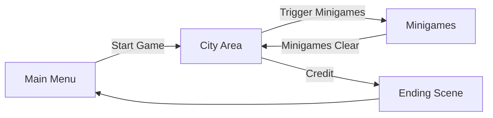
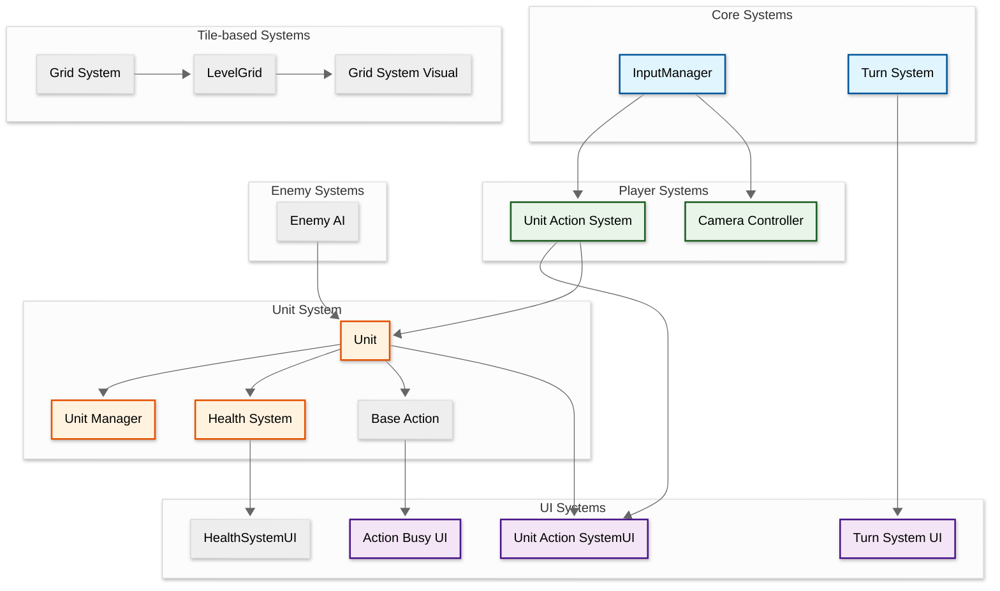
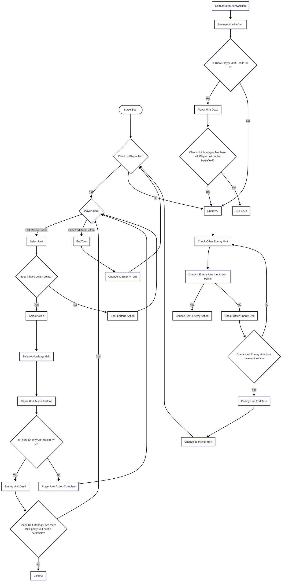
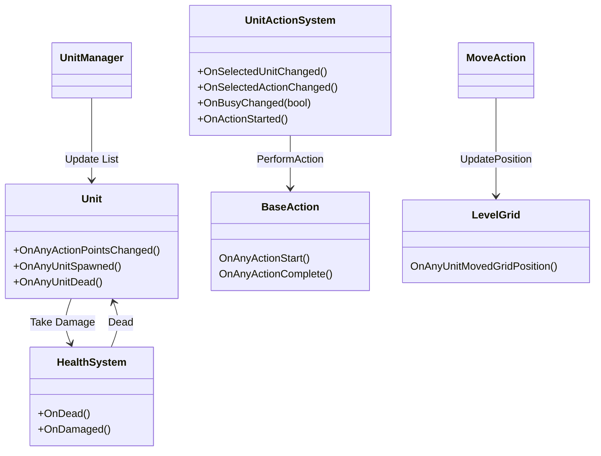

  
   

## Developer & Contributions
**Evan Jonathan** (Game Programmer)  
**Radovieo Anugraha Daffacetta** (Game Artist) 
**Vincent Pho Wijaya** (Game Designer) 

## About
Sunside Cafe is a story-driven cafe simulation game about Lucas, a college student struggling with burnout. 
During his summer vacation, he travels to his uncle's small town in hopes of finding peace and recovering from the pressure of university life. 
While helping run his uncle's cafe, Lucas gradually uncovers the problems of the uncle—and his own
 

 

## Key Features

• Customer Order Management  
• Cafe Upgrade System 
• Daily Schedule Progression 
• Rhythm-Based Mindfulness Minigames 
• Multiple Story Endings 
• For each minigame, it is in a different scene 

<table>
<tr>
<td align="center" width="50%">
<strong>Explore the island</strong> 

</td>
</tr>
</table>

## Scene Flow

## Layer / Module Design

## Modules and Features

The 2D Narrative Adventure gameplay with SideScrollPersonController,InputManager, GameManager, and DialogueRunnerSingleton is powered by an extensive Unity C# scripting system.

|  📂 Name     | 🎬 Scene |  📋 Responsibility                                                 |
| ------------------- |----------------| ------------------------------------------------------------ |
| `SideScrollPersonController` | City_Area |Handles player movement and controls in side-scrolling sections|
| `InputManager` | City_Area |Handles player input through the Input System |
| `BaristaManager`    | All Cafe_Barista scenes |Manages the flow of the Barista minigame|
|  `RecipeManager.cs` | All Cafe_Barista scenes | Manages recipes and ingredient combinations|
| `KettleManager.cs`  | All Cafe_Barista scenes | Handles ingredient mixing and brewing processes|
| `GameManager.cs`  | City_Area | Manages game states and minigame initialization|
| `ScheduleManager.cs`| All Cafe_ShiftSystem scenes | Handles unit animations and visual effects|
| `MindfulnessManager.cs`| All Mindfulness_Practice scenes| Manages the mindfulness minigame flow  |
| `DialogueRunnerSingleton.cs`| City_Area | Handles dialogue events and progression |
| `TimelineDayDreamController.cs`| City_Area | Manages Timeline events and triggers |

 

## Game Flow Chart

 

## Event Signal Diagram

 
## Play The Game
<a href="https://drive.google.com/file/d/1HzndWfJgO8YdllTWBCcsIL16DL1zuH0n/view?usp=sharing">Download</a>

 

## Installation & Setup
Using Google Drive
1. Download Sunside Cafe from Google Drive
2. Extract .zip file
3. Launch Sunside Cafe to play.

Using Github
1. Clone this repository
2. Open the project in Unity (6 or later recommended)
3. Open the main gameplay scene
4. Press Play to start testing

## Controls
## Player Controller
| Key Binding       | Function          |
| ----------------- | ----------------- |
| W,A,S,D           | Standard movement |
| E             | Interact with Objects/Environments/NPCs            |
| Esc              | Pause |
| Tab            | Open/Close Journal |
| Shift           | Sprint/Run            |

## Barista Minigames
| Key Binding       | Function          |
| ----------------- | ----------------- |
| Tab          | Open/Close Recipe |
| Left Mouse Button | Pick up ingredients, drag kettle, serve food to customers|

## Scheduling Minigames
| Key Binding       | Function          |
| ----------------- | ----------------- |
| Q                  | Rotate Left schedule |
| E                  | Rotate Right schedule |
| Left Mouse Button  | Drag employee schedule |
| Right Mouse Button | Delete employee schedule|

## Mindfulness Minigames
| Key Binding       | Function          |
| ----------------- | ----------------- |
| Space          | Press at the right timing to complete the mindfulness activity |

 

